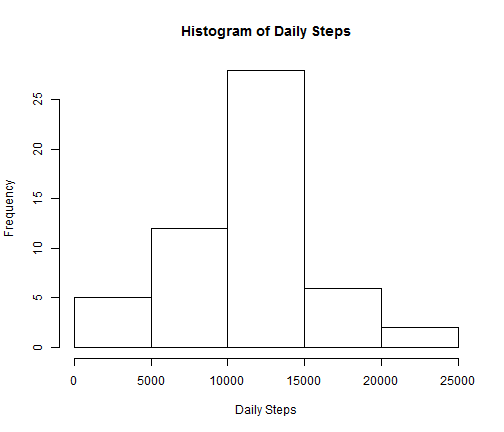
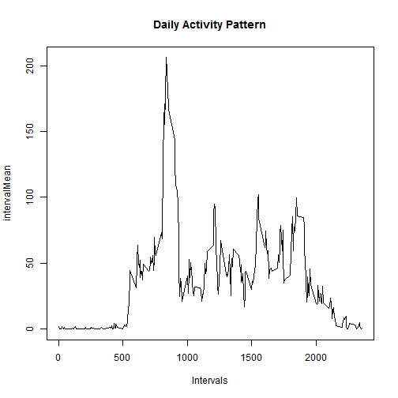
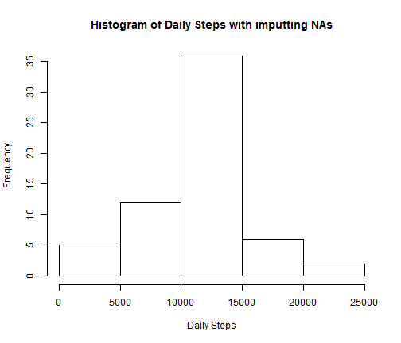

 RepData_PeerAssessment1
========================================================

## Loading and preprocessing the data


```r
setwd("C://Users//PengyiSun//Documents//Coursera")
data<-read.csv("activity.csv",header=T)
```

## What is mean total number of steps taken per day?

```r
totalSteps<-sum(data$steps,na.rm=T)
days<-as.numeric(max(as.Date(data$date))-min(as.Date(data$date)))
stepsMean<-totalSteps/days
datana<-data[which(!is.na(data$steps)),]
dailysum<- tapply(datana$steps,datana$date,sum)
stepsMedian<-median(dailysum,na.rm=T)
```


```r
hist(dailysum,main="Histogram of Daily Steps",xlab="Daily Steps")
```

 


```r
stepsMean
```

```
## [1] 9510
```

```r
stepsMedian
```

```
## [1] 10765
```

## What is the average daily activity pattern?

```r
intervalMean<-tapply(datana$steps,datana$interval,mean)
plot(datana$interval[which(datana$date=="2012-10-02")],intervalMean,type="l",main="Daily Activity Pattern", xlab="Intervals")
```

 
The interval contains the maximum number of steps:

```r
intervalMean[intervalMean==max(intervalMean)]
```

```
##   835 
## 206.2
```

## Imputing missing values

```r
nrow(data[which(is.na(data$steps)),])
```

```
## [1] 2304
```
To fill in missing values, we can use the 5-minute interval mean.

```r
intMean<-data.frame(intervalMean)
intMean<-cbind(row.names(intMean),intMean)
colnames(intMean)<-c("Interval","IntervalMean")
newData<-data
for(i in 1:sum(is.na(data$steps))){
  newData[which(is.na(newData$steps)),]$steps[1]<-intMean[which(intMean$Interval==data[which(is.na(data$steps)),][i,3]),2]
}
```
Computing mean and meidan for the new dataset:

```r
newtotalSteps<-sum(newData$steps)
newdays<-as.numeric(max(as.Date(newData$date))-min(as.Date(newData$date)))
newstepsMean<-newtotalSteps/newdays
newdailysum<- tapply(newData$steps,newData$date,sum)
newstepsMedian<-median(newdailysum)
```


```r
hist(newdailysum,main="Histogram of Daily Steps with imputting NAs",xlab="Daily Steps")
```

 


```r
newstepsMean
```

```
## [1] 10946
```

```r
newstepsMedian
```

```
## [1] 10766
```
The number is different from first part of assignment. It increases both mean and median.

## Are there differences in activity patterns between weekdays and weekends?
Create a new day variable in the dataset:

```r
newData$day<-"weekday"
newData[is.element(weekdays(as.Date(newData[,2])),c("Saturday","Sunday")),]$day<-"weekend"
newData<-transform(newData,day=factor(day))
```
Plot for weekday and weekend:

```r
library(lattice)
newintervalMean<-aggregate(newData$steps,by=list(interval=newData$interval,day=newData$day),FUN=mean)
colnames(newintervalMean)[3]<-"steps"
xyplot( steps ~ interval | day, data = newintervalMean, layout = c(1, 2), type="l")
```

 
